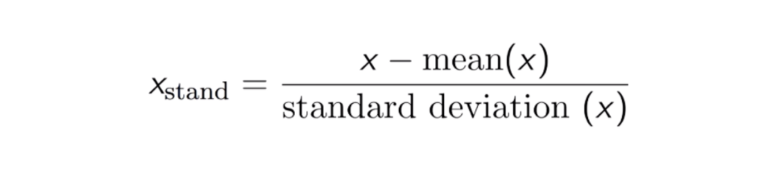
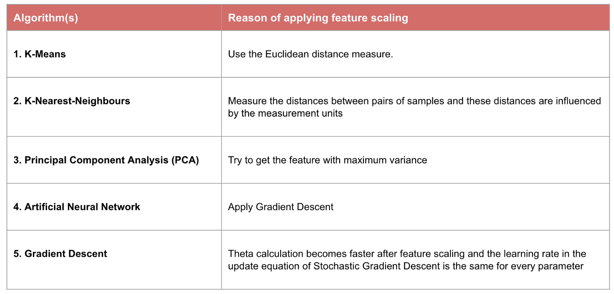

# Data Transformation: Standardization vs Normalization

Data transformation is a very important part of the data science process. It is one of the first steps to increasing accuracy in your models from data you procure. A model will be as good or bad as the data you train the model with. The magnitude of different features affects different machine learning models for various reasons.
“For example, consider a data set containing two features, age, and income. Here age ranges from 0–100, while income ranges from 0 to a huge amount which is mostly higher than 100. Income is about 1,000 times larger than age. So, these two features are in very different ranges. When we do further analysis, like multivariate linear regression, for example, the attributed income will intrinsically influence the result more due to its larger value. But this doesn’t necessarily mean it is more important as a predictor. Therefore, the range of all features should be scaled so that each feature contributes approximately proportionately to the final distance.” A situation like this is why feature scaling is a very important thing.

I will be discussing two key feature scaling methods standardization and normalization and how to apply them.

But first of all, what is feature scaling? Feature scaling is a technique to change the values of numeric columns in the dataset to use a common scale, without distorting differences in the ranges of values or losing information. NB: Not every dataset requires feature scaling. It is required only when features have different ranges

## What is Normalization?
It’s a scaling technique that when applied to features rescales them, so they range between [0,1]. Normalization is also known as Max-Min Normalization due to the Min-Max scaling of features with a distribution value between 0 and 1. The general equation is as follows:

In the above formula, x is the original value and xnorm is the normalized value. 

## What is Standardization?
Standardization (also called, Z-score normalization) is a scaling technique such that when it is applied the features will be rescaled so that they’ll have the properties of a standard normal distribution with mean,μ=0 and standard deviation, σ=1; where μ is the mean (average) and σ is the standard deviation from the mean. Standardization is very useful for optimization algorithms like gradient descent. Standardization helps gradient descent converge much faster with feature scaling than without it. The equation is shown below:

This scales the features in a way that they range between [-1,1]  

## When to use what?
In contrast to standardisation, we will obtain smaller standard deviations through the process of Normalisation.
Normalisation typically allows us to transform the data with varying scales so that no specific dimension will dominate the statistics, and it does not require making a very strong assumption about the distribution of the data, such as k-nearest neighbours and artificial neural networks. However, Normalisation does not treat outliers very well. On the contrary, standardisation allows users to better handle the outliers and facilitate convergence for some computational algorithms like gradient descent. Therefore, we usually prefer Standardisation over Normalisation.
However, even with the above there is no obvious answer to this question: it really depends on the application.
What algorithms need feature scaling?

