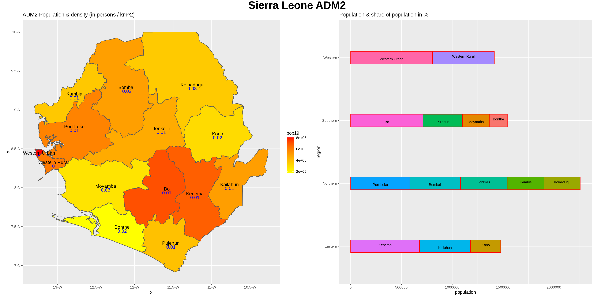
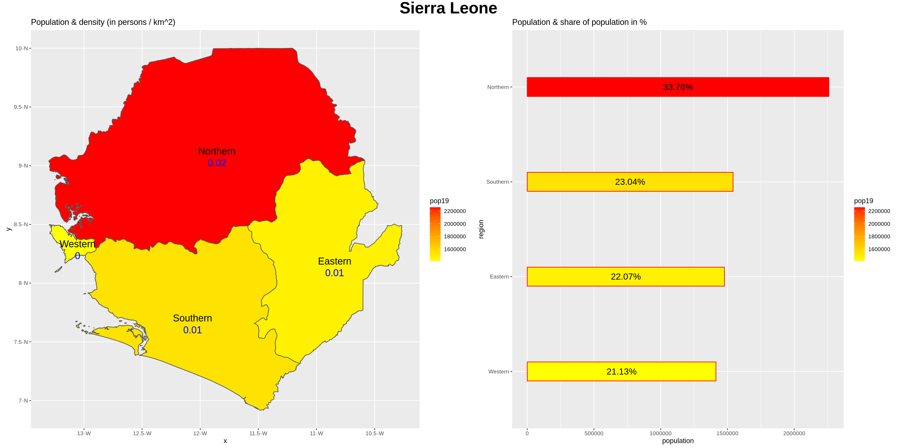
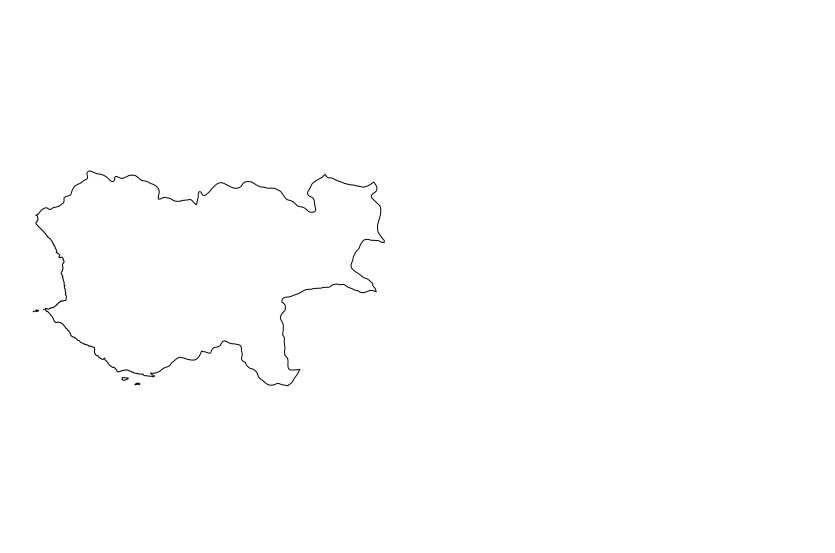
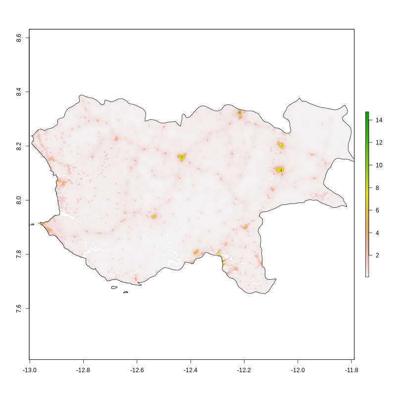
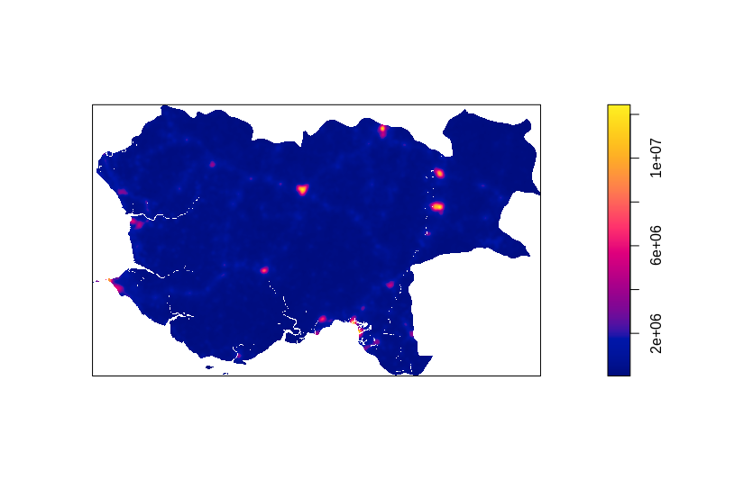
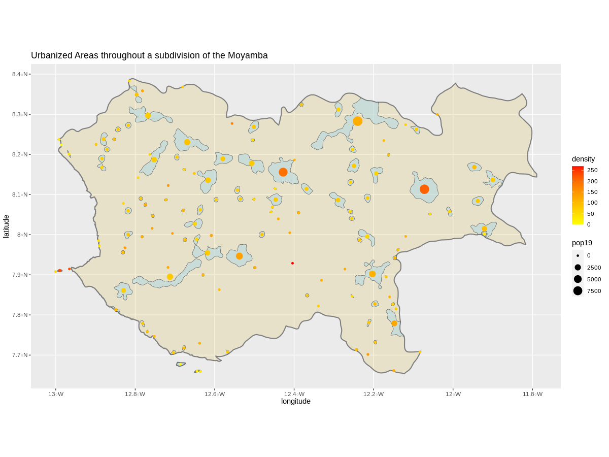

## Project 1

The country I chose is is Sierra Leone. I simply chose Sierra Leone because I know it's one of the countries in Africa with a smaller population  
and it also happen to fit the specification of a low income country. Plus I wanted to explore other neigbouring countries to my home country Ghana  

From the ADM 2 plot, it's obvious the West Urban district is the most populous region in Sierra Leone. This all makes sense after you realize that this is  
where the capital Freetown is located and in almost every country in the world people tend to flood to the capital based on the economic opportunities they present  
However, overall, the Northern part of the country has the largest population in all. Compared to the other regions of the country, the western region where West Urban  
is found is quite small.

For this project however, I focused on a section of Sierra Leone called Moyamba. The Moyamba district is in the Southern Province and borders the Atlantic Ocean.  

The majority of the citizens reside in rural areas. The main source of occupation for this area happens to be agriculture, with it serving as a livelihood for about  
71% of the population in the area. It also happens to be one of Sierra Leone's most ethnically diverse districts. The population of Moyamba is a little over 268800 based on  
2019 population data of Sierra Leone. Below is a plot showing the spread of the population.

Below is also a plot of the de facto settlements of the region. As you can tell from the scale or legend, the red/orange swatches represent areas with large number of settlements  

Here is another defacto settlement plot, but this time with the concentrated swatches much highlighted or isolated  

To give a better idea of the plot above, I decided to run some processes to isolate the areas that were more densely populated and below is the result  

As you can tell from the above plot the size of the dot on the contoured areas and color tells us a bit more information than just looking at the previous plot.  
The bigger the dot, the higher the population, and the more red it is, the more densely popuated it is for that given area.  
Also, you can tell there is a fair amount of distance between settlements. The middle area however has the smallest distance between settlements. There is also a cluster  
of settlements around the edges of Moyamba. My guess is this is families that are fishermen or fishmongers by trade because fishing is another primary occupation in the area  

To get a further view of what the area is like, I added roads and healthcare facilities and it seems the area has a great amount of roads with dirth paths or unpaved roads here and there, but overall  
they have a good number of roads. The green dot represents a clinic and the blue dot a hospital. It seems these amenities are hardly prevalent in the area. This affected greatly during the Ebola epidemic --  
I came across an article while researching the area talking about how the needs of the area went unment healthwise most of the time and how this affected them during the Ebola epidemic.

