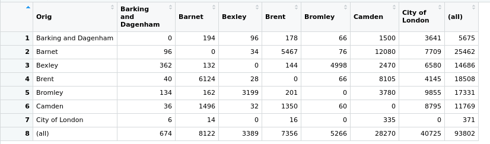
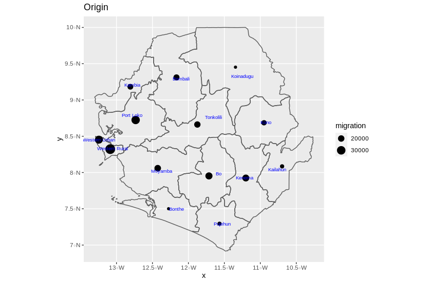
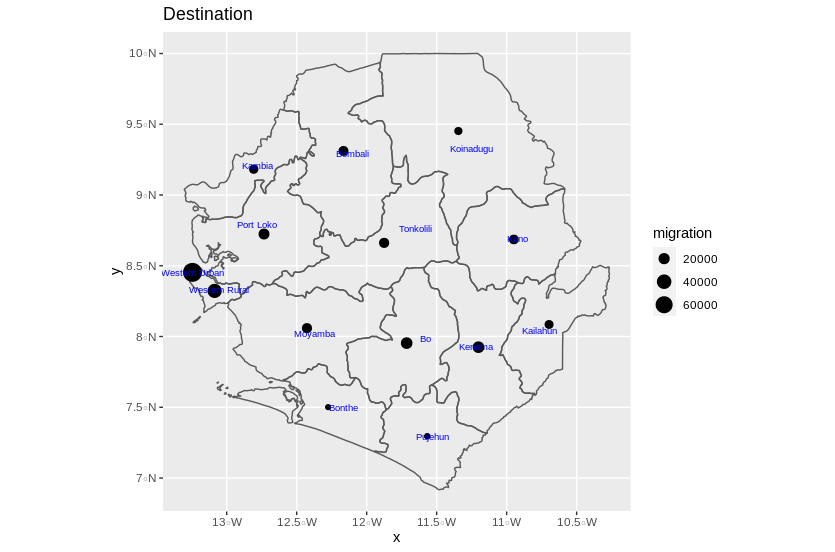
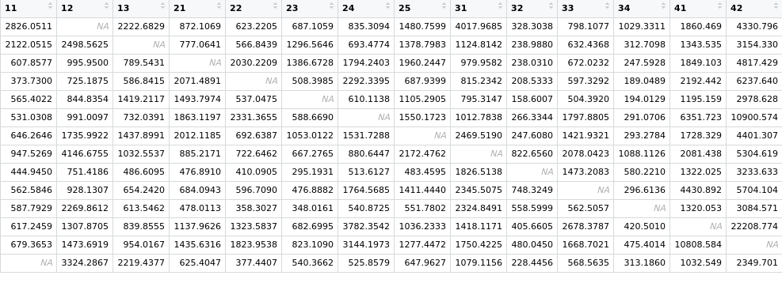
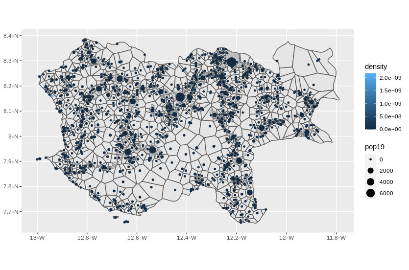

## London Gravity Model
### What is a gravity model?

The Gravity Model is a model used to estimate the amount of interaction between two cities. It is based on Newton's universal law of gravitation, which measured the attraction of two objects based on their mass and distance. The gravity model for cities works in the same way; the amount of interaction between two cities is proportional to the size of the cities and inversely proportional to their distance squared. This explains why cities that are far apart, such as New York and Los Angeles, still interact a lot despite being on either side of the United States, thousands of miles apart

To learn more about how gravity models, how they work, and what they look like I followed the tutorial given by a step-by-step tutorial called <em> Dr Ds Idiots Guide to Spatial Interaction Modelling for Dummies - Part 1: The Unconstrained (Total Constrained) Model </em>. The tutorial used the city of London in the U.K to implement a gravity model.  In the tutorial, population and income data were the factors used to observe movement in this gravity model. They were used in weighing the probability of persons moving from one place to another. The matrix illustrates the number of persons that migrated from one place to another as determined by the income and population factors.

## ODM for Sierra Leone
After following the London tutorial, I decided to look at the gravity model for the country of Sierra Leone, which has been the country I have used in every project this semester. For Sierra Leone, I looked at the migration flows at an ADM2 level, which has been how most of the projects I have done on Sierra Leone have turned out to be. Most of the data collected on Sierra Leone seems to be at the ADM2 level. To visualize the migration flow in Sierra Leone, I procured data on 5 year internal migration flow from worldpop.org. Using the data procured, Icreated plots showing the origin and destination flow sums for Sierra Leone’s ADM2. Below are the plots showing the flow sums for Sierra Leone’s ADM2

[Talk about the Plots]

A variable I would have added for further specification of my gravity model would have been distance to major roads. I believe this is an important factor. If one lives closer to a major road there is the likelihood that they may do a lot more migration than someone living near a less frequented road. For example the roads leading to D.C are major ones because there are a lot of people that live in the Northern Virginia area and also work there or in D.C, so there is always large levels of migration to the area. I feel having a the variable or factor distance to major road would have helped

## How is the OD matrix used to model migration for my selected country?

First of all what are OD matrices? OD matrices are the most common way to define demand for simulation. Each origin and each destination is a node in the network. Classically, for each origin the OD matrix has a row, and for each destination the OD matrix has a column. In each cell of the matrix the demand for the specific Origin-Destination pair (OD pair) is given. 
The above description is the same way the OD matrix for Sierra Leone was put together in my code. The output below is a screenshot of the OD matrix for Sierra Leone where the NA represents internal migration within the same area and any cell that was not NA represented movement from one district to another. 

Below is a better representation of the migration patterns between the various districts in Sierra Leone’s ADM2

## Animation
Below is an animation of migration patterns in Sierra Leone’s ADM2.

If I had further time, I would have done some research into modifying the number of points and time variables to have a much better or accurate output of movement across Sierra Leone. I would modify the points based on the proportion of people in each area. We could get even more accurate if we get more granular data on the movement of people across Sierra Leone by week or month to better model or simulate the movements. We could have also incorporated other factors to check for specific movement across the country instead of just simulation movement of individuals across the country just like in the London example that used income as a factor to model movement. For the time variable, we don’t have an actual time variable incorporated into our animated plot above, so we could have incorporated one. We could have done more research to try to determine when most migration occurs. If we had an idea of when most migration occurred it would have help narrow down the temporal accuracy of our model or we could have gotten a specified length of time randomly the migration over that period of time to see how things play out and then continue to fine tune our model to give better temporal accuracy

## Voronoi
At the ADM2 level for Sierra Leone, using the defacto settlements from project 1 for Moyamba, I produced a tesselation of voronoi polygons -- Voronoi plots are a simple concept, and it's based on the minimal distance needed to reach a landmark. If you need to go to a metro station, the most natural algorithm is going to the nearest one. Simple, isn't it?. Below is the voronoi plot:

Above, Moyamba is  divided into cells, each cell covering the region closest to a particular centre. Voronoi tesselations come in handy. Say for example you want to choose a location for a new service, such as a school, which is as far as possible from existing schools while still serving the maximum number of families. A Voronoi diagram can be used to find the largest empty circle amid a collection of points, giving the ideal location for the new school. Of course, numerous parameters other than distance must be considered, but access time is often the critical factor.

A variable I would have included is distance to major road like I said at the beginning of this write up. I feel it is an important factor to tracking movement. Also just like how I would improve the animation above, I believe more granular data should be collected on migration flows and it would be great to get data on when exactly most of these migration times occur. Could it be during a particular festive season? A particular time of day? That would help improve the temporal accuracy. 
To integrate migration and transport activities we could use the transportation routes as routes travelled by the agents in our system when we do the simulation
