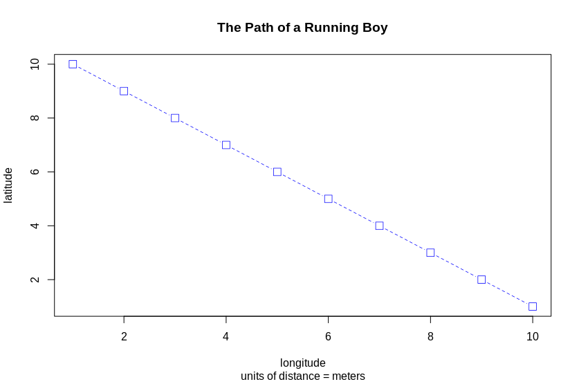
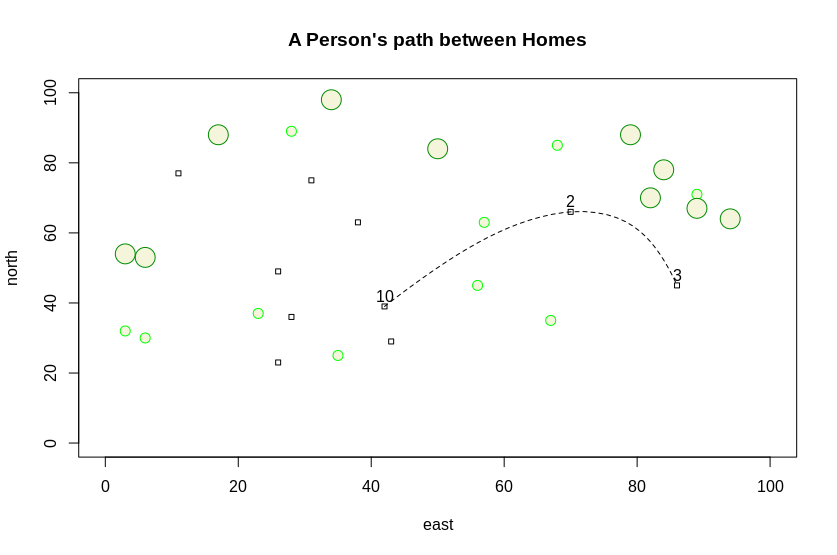
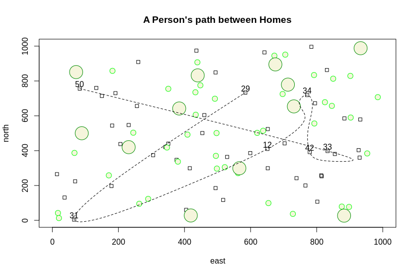

# Creating a Plot
This is a simple plot demonstrating the creation of vectors, plotting them, labeling the axes, and giving it a title
)

# Complicated Plot
This plot is more complicated than the above, since it involved the use of data frames. This plot also sought to simulate a neighborhood with 10 dwellings (squares) and 20 trees (circles) -- both big and small. There was also the random selection of 3 houses to act as a way for as to simulate transportation between dwellings in the form of connecting these 3 dwellings with lines.

# Challenge Question
This plot models a neighborhood with 50 dwelling units -- represented as squares -- over a 1000 x 1000 area.
Scattered around these dwelling are 52 trees -- 40 small ones and 12 large ones -- represented as circles.
The lines connecting the dwelling are to simulate transportation or movement to and from various dwellings.
In this case 7 random dwellings were selected and a path drawn between these dwellings to represent the transportation.

