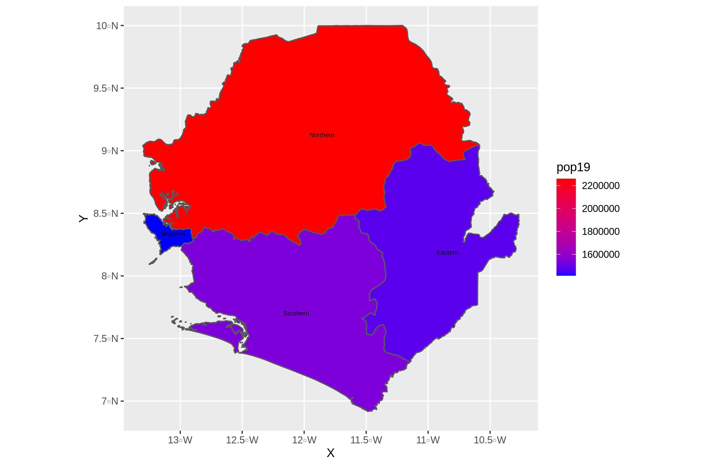
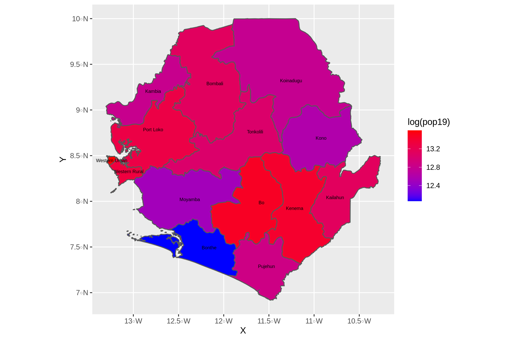
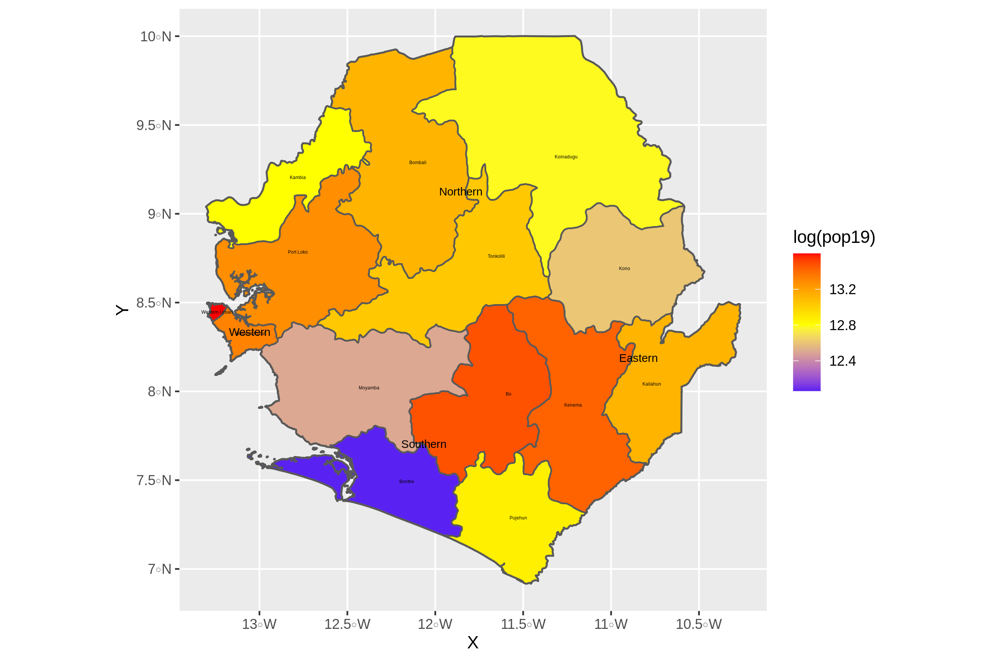

## Extracting and Plotting Population Data
Data on Sierra Leone's 2019 population was extracted from the WorldPop website and combine with the Sierra Leone ADM files to display a graphical representation of population count by color for Sierra Leone. Below are ADM1 and ADM2 respectively

## Combo of ADM1 and ADM2
The plot below is a combination of ADM1 and ADM2, but with a third color, to allow a color for a moderately sized population and not just binary classifcation of populous or not populous

